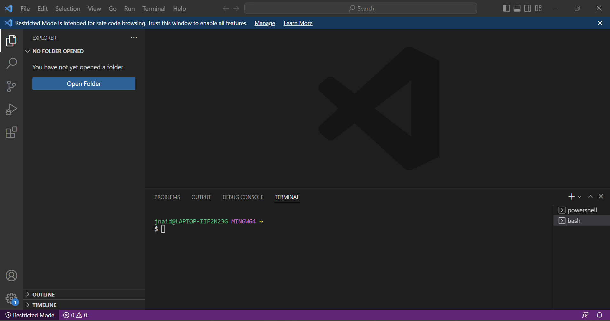
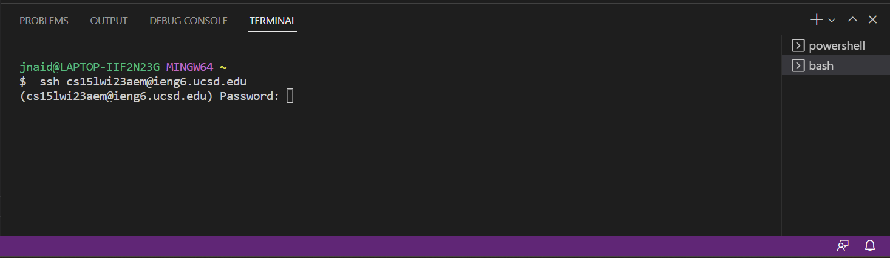
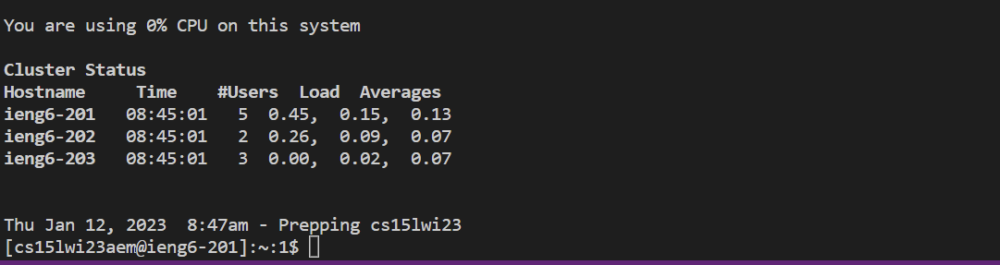
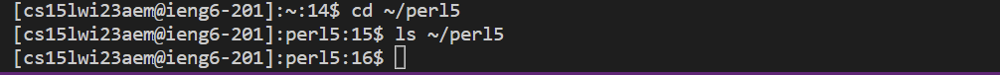

# How to Log into a Course-Specific Account on `ieng6`

## 1. Set up your course-specific account
The first step to getting connected is to ensure that your course-specific account is properly set up. Visit the [lookup page](https://sdacs.ucsd.edu/~icc/index.php) for your account and enter your credentials. Click on the course-specific account and follow the instructions to set up a password. I did this later in the process, but its better to do it now since the password change takes time to go into effect.

## 2. Install `Git` and `Visual Studio Code`
In order to remotely connect, we will use `git bash` in the terminal of `Visual Studio Code`. Use the links below to install both of these applications according to your operating system. I already had VS Code installed, so I only needed Git. 

[Link to Visual Studio Code](https://code.visualstudio.com/)

[Link to Git for Windows](https://gitforwindows.org/)

Once installed, follow [these instructions](https://stackoverflow.com/a/50527994) to open git bash in the Visual Studio Code terminal. Once completed, your visual studio window should look something like this:

## 3. Connect to the remote server
Now it's time to connect to the remote server. We will use the `ssh` (secure shell) command to connect to the remote server. Type the command below into the terminal, replacing `zz` with the letters in your account. For me, my letters are "aem", but each account is different.

`$ ssh cs15lwi23zz@ieng6.ucsd.edu`

You may be prompted with a warning making sure you want to connect. If this is the case, enter **yes**. I didn't get a warning because I've already connected before. When done properly, the terminal should end like this, asking for a password.

Finally, enter the new password you initialized when setting up your account. If you just set the password up, it might take some time to update (it did for me). This can take up to 15 minutes. When you're finally connected, this is what your output might look like:

Now you're connected! I then ran some commands as shown below, messing around and trying to navigate the remote computer. 

The **cd** command is used to navigated to a path on the remote server. Using the command in the format **cd (path-name-here)** will navigate you to the path you specify. Here I navigated to the folder "perl5" in the root directory.

The other command is **ls**, which lists the contents of the specified path. In this case, "perl5" is empty, and so nothing is returned. This command is useful when trying to navigated unfamiliar folders. 

With these commands you can now navigate the remote server! Now you can access and use a course-specific account on a remote server.
