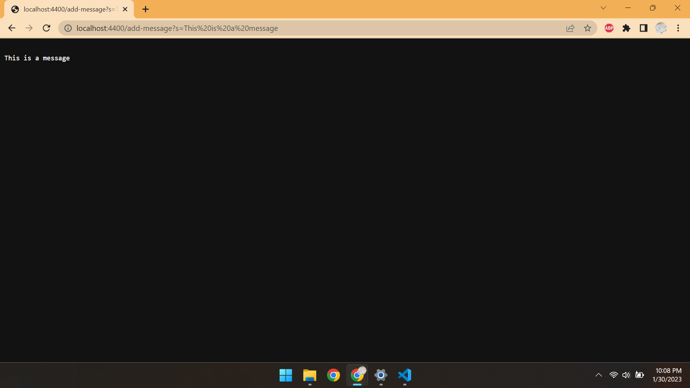
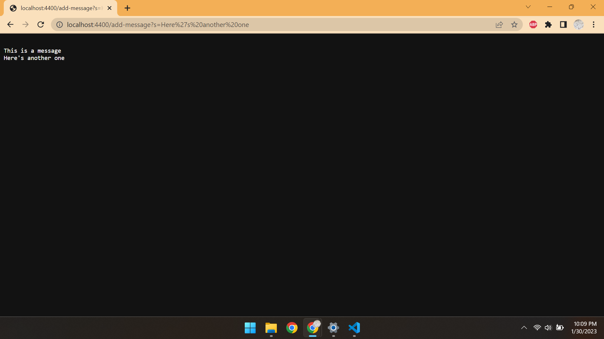
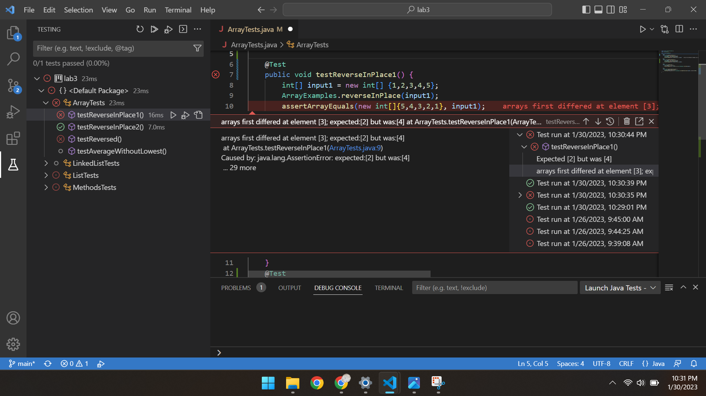
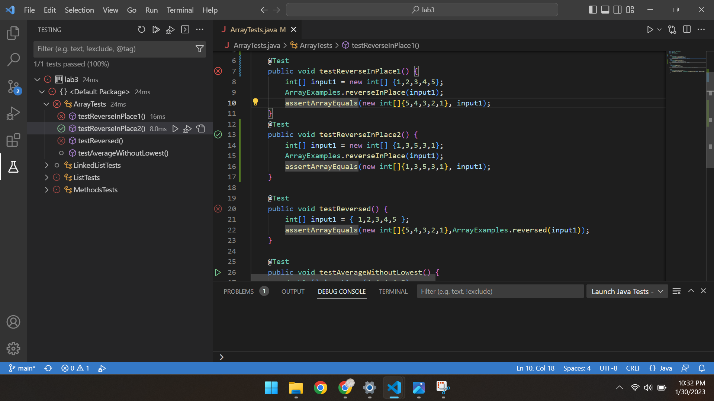

# Lab Report 2

## Part 1: Creating the StringServer
The web server `StringServer` is implemented below. It adds to a string, named `message`, as it receives requests.
```
import java.io.IOException;
import java.net.URI;

class Handler implements URLHandler {
    //String to be added to
    String message = "";

    public String handleRequest(URI url) {
        if (url.getPath().equals("/")) {
            return message;
        }
        else if (url.getPath().contains("/add-message")) {
            String[] parameters = url.getQuery().split("=");
            message += "\n"+parameters[1];
            return message;
        }
        return "404 Not Found!";
    }
}

class StringServer {
    public static void main(String[] args) throws IOException {
        if(args.length == 0){
            System.out.println("Missing port number! Try any number between 1024 to 49151");
            return;
        }

        int port = Integer.parseInt(args[0]);

        Server.start(port, new Handler());
    }
}
```

Here are two examples of messages being added.



The method being called is `handleRequest(URI url)`, which parses the request into a message string. The string "add-message" is present in the request, so the server's message will be added to. Here, the relevant argument being passed is "Here is a message". The `message` variable in the `Handler` class is concatenated with a new line and the message to be added.



Another "add-message" request is passed to the server. The process is repeated, except this time the relevant argument passed to the `handleRequest(URI url)` method is "Here's another one". The string `message` in the `Handler` class maintains the first message, and the new one is added on and displayed for the client.

## Part 2: JUnit
Here is the `reverseInPlace` method from Lab 3, which contains bugs:
```
// Changes the input array to be in reversed order
static void reverseInPlace(int[] arr) {
    for(int i = 0; i < arr.length; i += 1) {
      arr[i] = arr[arr.length - i - 1];
    }
}
```
A failure can be detected using a simple input array, `{1,2,3,4,5}`. After running the method, the array is expected to contain `{5,4,3,2,1}`. Here is a JUnit test demonstrating this failure-inducing input:
```
@Test
public void testReverseInPlace() {
    int[] input1 = new int[] {1,2,3,4,5};
    ArrayExamples.reverseInPlace(input1);
    assertArrayEquals(new int[]{5,4,3,2,1}, input1);
}
```
However, there are inputs that don't induce a failure. One such input is `{1,3,5,3,1}`, which is the same when reversed. The JUnit test is shown below:
```
@Test
public void testReverseInPlace() {
    int[] input1 = new int[] {1,3,5,3,1};
    ArrayExamples.reverseInPlace(input1);
    assertArrayEquals(new int[]{1,3,5,3,1}, input1);
}
```
Here is the symptom. The second test runs fine, but the first one produces an error. The array differs from the expected after the middle index.




Here is the code before and after being fixed.
Before:
```
// Changes the input array to be in reversed order
static void reverseInPlace(int[] arr) {
    for(int i = 0; i < arr.length; i += 1) {
      arr[i] = arr[arr.length - i - 1];
    }
}
```
After:
```
// Changes the input array to be in reversed order
static void reverseInPlace(int[] arr) {
    for(int i = 0; i < arr.length/2; i += 1) {
      int temp=arr[i];
      arr[i] = arr[arr.length - i - 1];
      arr[arr.length-i-1]=temp;
    }
}
```

The original code makes the array differ after the middle index because the left half of the array is overwritten before being used to assign the right half. In order to fix this, only half the array needs to be traversed, and each sequential value can be swapped with its appropriate index on the other side of the array.

## Part 3: What I've Learned
Most of the things I've learned in this class has been new to me so far. One of the most interesting things that I learned in week 2 was the basics of a server's backend. The internet seems like such a daunting topic, but seeing a simple server written in java and hosted on my own machine helped me get a better understanding of how a server works, such as using paths and requests. 
